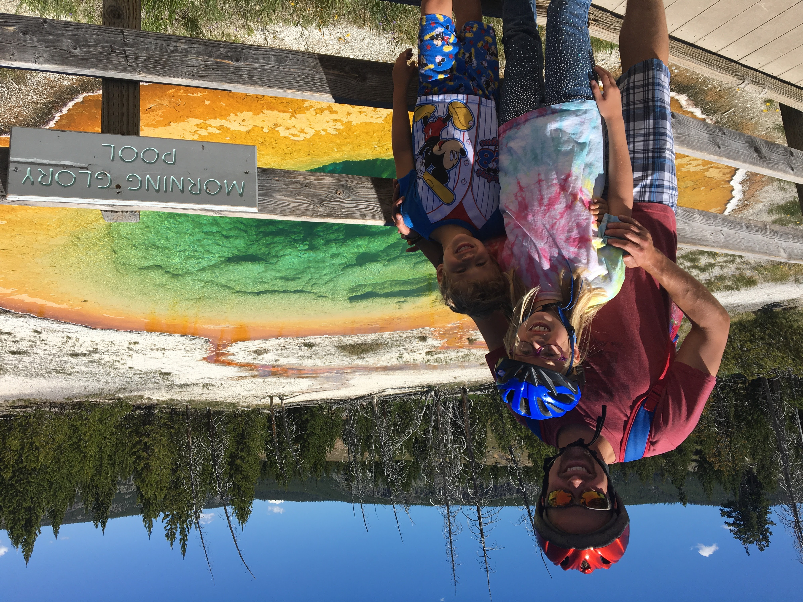
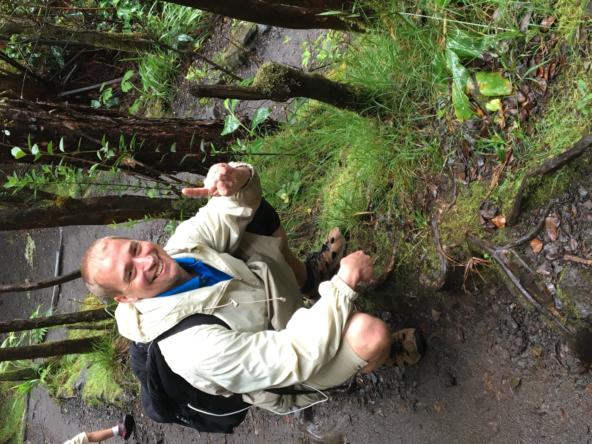
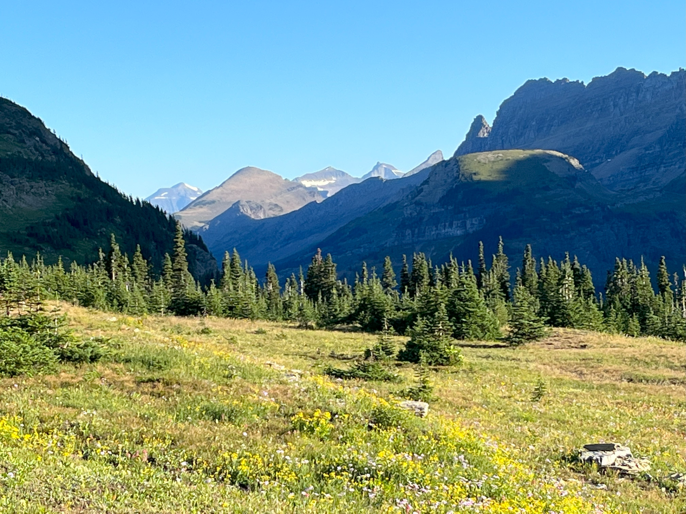

## We are under construction... but

---

### Here's My Story

{: .image }

---

---

---

---

The plastic pollution crisis is devastating both wildlife and human health. Over 8 million tons of plastic enter our oceans each year, choking marine life and disrupting ecosystems. Sea turtles, whales, and seabirds often mistake plastic for food, leading to injury or death. On land, Styrofoam and plastic waste take centuries to decompose, leaching harmful chemicals into the soil and water. For humans, microplastics are now found in the air we breathe, the water we drink, and the food we eat, linked to serious health issues like hormone disruption, cancer, and developmental problems in children.

I believe we can create real change, but it’s not something I can do alone. I’ve read, “If you want to go fast, go alone. If you want to go far, go together.” That’s why I’m asking for your help.

Please consider joining me on this journey. Even if you’re not ready to contribute financially, I challenge you to take a moment to reflect on your habits. What small changes can you make to reduce your impact? What sustainable choices can you embrace in your everyday life? Every little step counts. Together, we can make a lasting difference and create a cleaner, more sustainable future.
