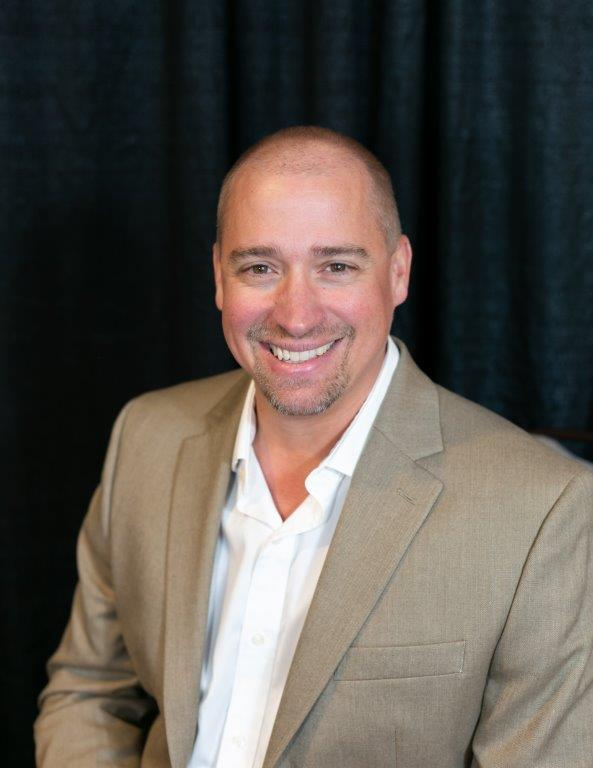
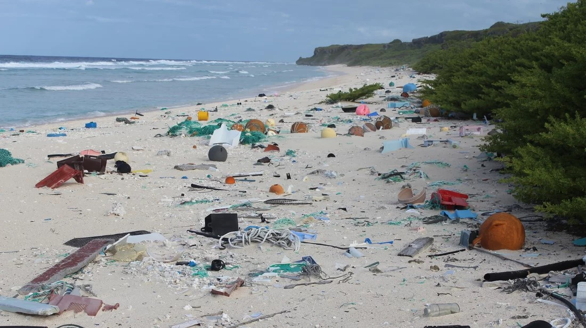

# Welcome to Eco Synergy Partners

## My Story

From a young age, I’ve always felt a deep connection to nature. Whether it was building forts and playing in the woods as a child or surfing and snorkeling in the ocean, this bond has shaped who I am. 

I have also always lived surrounded by water. I’ve lived along the banks of the Mississippi River, the shores of Jupiter, Florida, and now in Madison, Wisconsin, where Lake Mendota lies to the north and Lake Monona to the south.

As I reflect on my life, I realize that this connection to nature has been more profound and enduring than I realized. Over the years, I’ve also been somewhat of an entrepreneur and have started several businesses. However, I’ve always felt a strong pull to do something more meaningful. This led to the founding of Eco Synergy Partners.

## The Problem

The plastic pollution crisis is devastating both wildlife and human health. Over 8 million tons of plastic enter our oceans each year, choking marine life and disrupting ecosystems. Sea turtles, whales, and seabirds often mistake plastic for food, leading to injury or death. On land, Styrofoam and plastic waste take centuries to decompose, leaching harmful chemicals into the soil and water. For humans, microplastics are now found in the air we breathe, the water we drink, and the food we eat, linked to serious health issues like hormone disruption, cancer, and developmental problems in children.

## What We Do

Eco Synergy Partners is dedicated to reducing plastic and Styrofoam pollution by promoting sustainable alternatives for businesses, educating the public, and advocating for systemic change. We work directly with businesses to help them transition to more sustainable packaging options, engage in community cleanups, and host events to raise awareness and funds for a cleaner, more sustainable future.

## How You Can Help

Please consider joining me on this journey. Even if you’re not ready to contribute financially, I challenge you to take a moment to reflect on your habits. What small changes can you make to reduce your impact? What sustainable choices can you embrace in your everyday life? Every little step counts. Together, we can make a lasting difference and create a cleaner, more sustainable future.

[View My LinkedIn Profile](https://www.linkedin.com/in/nick-veech-35870310/)
