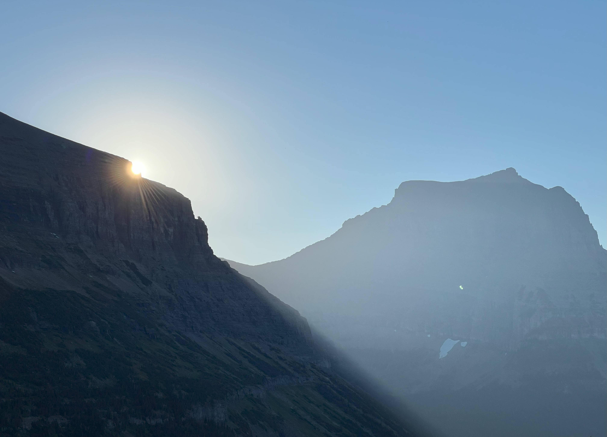

## We are under construction...but

---

### Here's My Story

  
  

    <h1>Welcome to Eco Synergy Partners</h1>
    
Reducing Plastic and Styrofoam Pollution

  

---

  

    
From a young age, I’ve always felt a deep connection to nature. Whether it was building forts, playing in the woods as a child, or snorkeling in the ocean, this bond has shaped who I am. I’ve also always lived surrounded by water: from the banks of the Mississippi River to the shores of Jupiter, Florida, and now in Madison, Wisconsin, with Lake Mendota and Lake Monona.

    
Over the years, I’ve started a few businesses but have always felt a stronger pull to do something more meaningful. After visiting places like Glacier National Park and the Everglades, I’ve noticed the growing impact of pollution on these landscapes, especially plastic and Styrofoam. It was a moment of frustration that led to the creation of Eco Synergy Partners, a nonprofit dedicated to reducing plastic and Styrofoam pollution.

    
    
The plastic pollution crisis is devastating both wildlife and human health. Over 8 million tons of plastic enter our oceans each year, choking marine life and disrupting ecosystems. Sea turtles, whales, and seabirds often mistake plastic for food, leading to injury or death. On land, Styrofoam and plastic waste take centuries to decompose, leaching harmful chemicals into the soil and water. For humans, microplastics are now found in the air we breathe, the water we drink, and the food we eat, linked to serious health issues like hormone disruption, cancer, and developmental problems in children.

    
    
I believe we can create real change, but it’s not something I can do alone. I’ve read, “If you want to go fast, go alone. If you want to go far, go together.” That’s why I’m asking for your help. Please consider joining me on this journey. Even if you’re not ready to contribute financially, I challenge you to take a moment to reflect on your habits. What small changes can you make to reduce your impact? What sustainable choices can you embrace in your everyday life? Every little step counts. Together, we can make a lasting difference and create a cleaner, more sustainable future.

    <a href="https://www.linkedin.com/in/nick-veech-35870310/" class="cta">View My LinkedIn Profile</a>
  

  

    
    
    
  

<footer>
  
&copy; 2025 Eco Synergy Partners

</footer>
